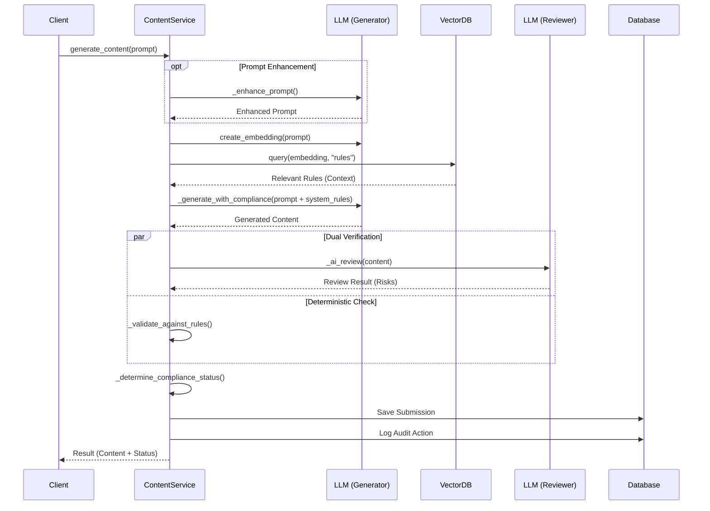

# Content Service Documentation

## Overview
The `ContentService` (`backend/app/services/content_service.py`) orchestrates the AI-driven content generation process. It ensures that all generated content adheres to defined compliance rules by integrating vector retrieval (RAG), strict system prompts, AI-based review, and deterministic validation.

## Key Responsibilities
- **Prompt Enhancement**: Optionally refines user prompts to include compliance guardrails before generation.
- **Regulatory Retrieval (RAG)**: Fetches relevant compliance rules from the Vector Database (Pinecone) based on the prompt's semantic context.
- **Content Generation**: Uses an LLM (Groq/Gemini) to generate content while injecting top-priority rules into the system prompt.
- **AI Review**: Uses a separate "Reviewer" LLM to auditing the generated text for risks.
- **Deterministic Validation**: Checks for forbidden keywords (e.g., "guaranteed results") defined in negative rules.
- **Audit Logging**: Records the generation event and decision summary.

## Core Functions

### `generate_content`
**Signature**: `async def generate_content(self, prompt: str, user_id: UUID, use_prompt_enhancer: bool = False) -> Dict`
- Main entry point.
- Coordinates the entire pipeline from prompt to saved submission.

### Internal Methods
- `_enhance_prompt`: Calls LLM to rewrite prompt for better compliance.
- `_retrieve_regulatory_context`: Creates embeddings for the prompt and queries Pinecone for relevant rules.
- `_generate_with_compliance`: Constructs a system prompt with rules and context, then calls the Generator LLM.
- `_ai_review`: Calls the Reviewer LLM to analyze the output.
- `_validate_against_rules`: Performs keyword/pattern matching against active rules.

## Dependencies
- **LLMProvider**: For generation and embeddings (Groq/Gemini).
- **VectorProvider**: For retrieving context (Pinecone).
- **AuditService**: For logging actions.
- **Database**: PostgreSQL for storing submissions.

## Workflow Diagram

