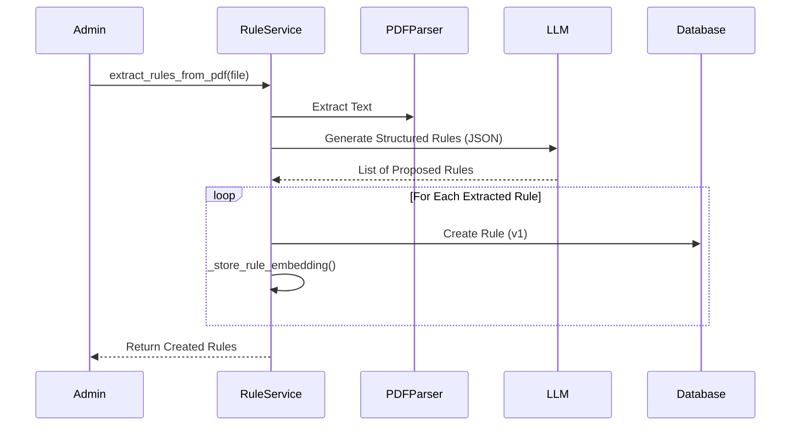
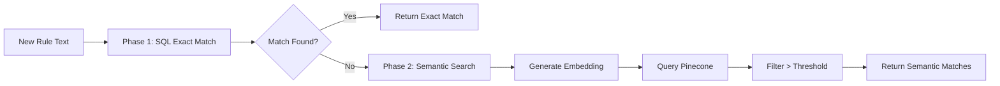

# Rule Service Documentation

## Overview
The `RuleService` (`backend/app/services/rule_service.py`) manages the lifecycle of compliance rules. It handles creation, versioning, activation, and automated extraction of rules from regulatory documents. It works closely with the `DuplicateDetector` to ensure rule repository hygiene.

## Key Responsibilities
- **Rule Lifecycle**: Create, Read, Update (Versioning), Delete (Deactivate).
- **Immutable Versioning**: Updates create new rule versions; old versions remain for audit trails.
- **Vector Indexing**: Automatically computes and stores embeddings for new rules in Pinecone to enable semantic search.
- **Automated Extraction**: Uses LLM to parse PDF regulatory docs and propose structured rules.
- **Duplicate Detection**: Identifies potential duplicate rules before creation using hybrid search.

## Core Functions

### `create_rule` / `update_rule`
- Creates or updates rules.
- Automatically handles version incrementing.
- Triggers embedding generation and Pinecone upsert.
- Logs actions to AuditService.

### `extract_rules_from_pdf`
- Extracts text from a regulation PDF.
- Prompts LLM to identify and structure rules (Rule Text, Category, Severity).

### `DuplicateDetector.check_duplicates` (Helper Service)
- **Phase 1**: Checks for exact SQL matches (case-insensitive).
- **Phase 2**: Checks for semantic similarity using vector search (Pinecone).

## Workflow Diagram (Rule Extraction)

## Workflow Diagram (Duplicate Detection)

